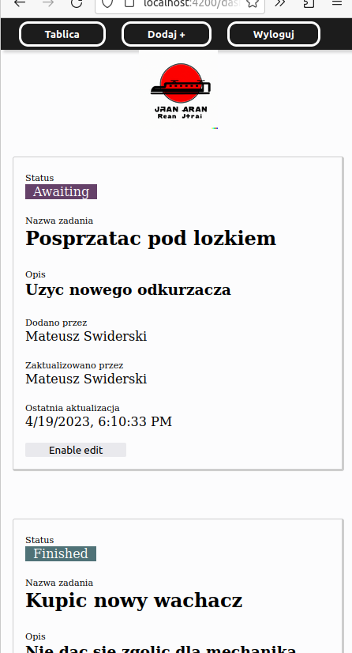

## Manual run using Angular and Nest CLI
```
cd ./backend && nest start
cd ../client && ng serve --proxy-config proxy.json
```
or
```
cd ./backend && npm run start
cd ../client && npm run start
```

## Run with Docker
```
// build docker image using dockerfile
$ sudo docker build -t reco .
// run
$ sudo docker run -p 5000:5000 reco
```

# About
This application is built using the Nest.js framework for the backend and Angular for the frontend. The backend uses a MongoDB database with Mongoose for object modeling and ORM relations.

The application uses a proxy on port 3000 to handle API requests, instead of using a specific API URL. This is done through the use of an Angular proxy configuration file (proxy.json) that specifies which paths should be proxied to the backend API.
#### (To build only one Docker container)

---------------------------------

The application also includes several features, such as JWT authentication, caching, SCSS styling, HTTP interceptor, and ORM relations. 